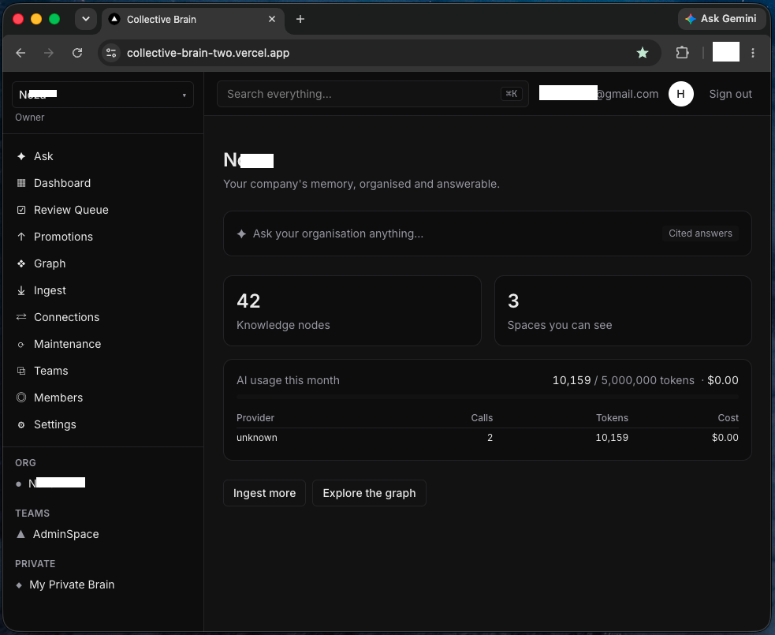
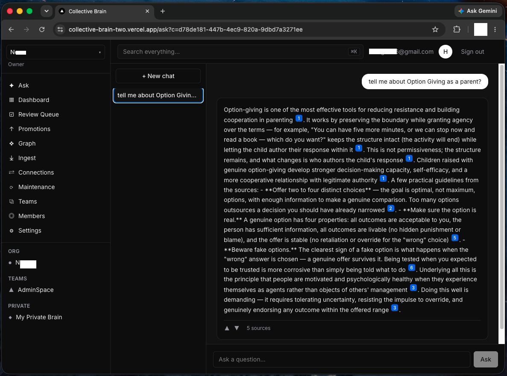
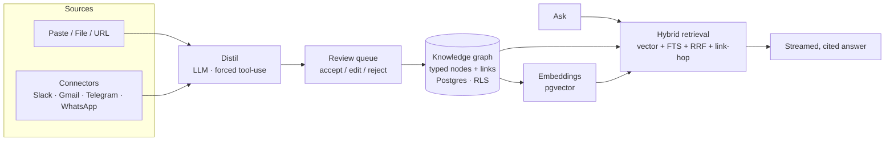

<div align="center">

# 🧠 Collective Brain

**Your company's memory — organised, permissioned, and answerable.**

A multi-tenant knowledge-graph app for SME teams. Pour in scattered docs, chats,
and emails; get back a clean graph of typed, linked knowledge you can question in
plain English — with every answer cited and every permission enforced in the
database.

[**Live demo →**](https://collective-brain-two.vercel.app)

[](https://nextjs.org/)
[](https://react.dev/)
[](https://www.typescriptlang.org/)
[](https://supabase.com/)
[](https://tailwindcss.com/)
[](https://www.anthropic.com/)
[](LICENSE)

</div>

---

## What it is

Every team's knowledge lives in a dozen places — Slack threads, meeting
transcripts, PDFs, half-remembered decisions. **Collective Brain** ingests that
raw material, uses an LLM to distil it into **atomic, typed knowledge nodes**,
links them into a graph, and lets anyone on the team ask questions and get
**answers grounded only in what the company actually knows** — cited back to the
source node.

Crucially, permissions aren't an app-layer afterthought: they're **enforced in
Postgres with Row-Level Security, before any content ever reaches a model.** Two
organisations can't see each other's anything — and that guarantee is proven by
tests, not asserted in a doc.

<div align="center">



</div>

---

## Highlights

- 🔒 **Database-enforced permissions** — Postgres RLS, default-deny, checked
  before content reaches the app or the model.
- 📥 **LLM-powered ingest** — paste, upload, link, or auto-sync from connectors →
  distilled into typed nodes → human review queue.
- 💬 **Cited answers (RAG)** — hybrid retrieval + streamed responses with inline
  `[n]` citations; unanswerable questions are logged as knowledge gaps.
- 🔀 **Swappable LLM providers** — Anthropic, Kimi (Moonshot), and GLM (Zhipu)
  behind one adapter, configurable per organisation.
- 💵 **Usage & cost controls** — per-provider token + dollar metering, with
  monthly caps that pause spend automatically.

---

## Features

### 📥 Capture & distil
- Ingest from **paste, file upload, or URL** — plus auto-sync **connectors**
  (Slack, Gmail, Telegram, WhatsApp).
- An LLM distils raw material into **atomic, typed nodes** via forced
  structured tool-use — one fact/decision/procedure each, with a searchable
  title and concise markdown body.
- **Review queue** — accept, edit-then-accept, reject, or bulk-accept
  high-confidence proposals, with duplicate warnings from embedding similarity.

### 🗂️ Knowledge base
- **Typed nodes** — `fact` · `decision` · `sop` · `person` · `client` ·
  `project` · `meeting` · `idea`.
- **Markdown editor** with `[[wikilink]]` autocomplete and live preview;
  wikilinks resolve into real graph edges.
- **Versioning** (every save snapshots a version), **backlinks**, and
  **full-text search** grouped by type.

### 💬 Ask (cited RAG)
- **Hybrid retrieval** — pgvector similarity + keyword full-text search fused
  with reciprocal-rank fusion, then one-hop link expansion.
- Answers **stream** in and cite sources inline with `[n]`; citation chips open
  the source node in a side panel.
- Grounded-only: if the brain doesn't contain the answer, it says so and logs a
  **knowledge gap** — no hallucinated filler.

<div align="center">



</div>

### ❖ Graph view
- Force-directed graph of the org's nodes and links, **colour-coded by type**,
  with click-to-filter and node search.

### 👥 Teams & collaboration
- **Organisations, teams, and roles** (owner / admin / lead / member / viewer).
- **Spaces** — private, team, and org-wide — with grant-based sharing.
- **Invites** with email delivery (falls back to a copyable join link) and a
  **promotion workflow** to elevate a private note into a shared space.

### 🔀 Multi-provider LLM + cost controls
- **Anthropic, Kimi (Moonshot), and GLM (Zhipu)** through a single adapter (all
  speak the Anthropic Messages API).
- **Per-org provider settings** — an admin picks the provider and models on a
  Settings page, with a **"test connection"** that dry-runs both the streaming
  and structured-output paths.
- **Metering & caps** — every call records provider, model, tokens, and computed
  cost; monthly **token and dollar caps** pause Ask and ingest when hit; the
  dashboard breaks spend down by provider.

### 🔧 Maintenance & housekeeping
- Scheduled **maintenance agents** — stale-node scan, knowledge-gap report,
  duplicate scan, and a **weekly digest** emailed to owners/admins.
- **Export** — download any space as an Obsidian-compatible vault (`.zip`).

---

## Security model

Permissions are a first-class, database-level concern:

- **Row-Level Security on every table**, default-deny. Permission primitives
  (`can_read_space` / `can_write_space`) live in the database.
- **Enforced before the model** — retrieval runs under the caller's RLS context,
  so a model only ever sees content the user is allowed to see.
- **Proven, not promised** — the exit-gate test suite asserts that two orgs
  cannot see each other's nodes, spaces, memberships, teams, or orgs (via count,
  by-PK, and insert/update/delete), plus private/team/org boundaries within an
  org.

```bash
pnpm test:rls   # the cross-tenant isolation gate
```

---

## Tech stack

| Layer | Technology |
|---|---|
| **Framework** | Next.js 16 (App Router), React 19, TypeScript (strict) |
| **Styling** | Tailwind CSS 4 |
| **Database** | Supabase — Postgres, `pgvector`, Row-Level Security, Auth |
| **LLM** | Claude API (`@anthropic-ai/sdk`); Kimi & GLM via their Anthropic-compatible endpoints |
| **Retrieval** | pgvector + Postgres full-text search, reciprocal-rank fusion |
| **Graph UI** | vis-network |
| **Content** | react-markdown + remark-gfm, JSZip (export) |
| **Validation** | Zod |
| **Email** | Resend |
| **Monitoring** | Sentry |
| **Testing** | Vitest against PGlite (embedded Postgres — no Docker) |
| **Tooling / deploy** | pnpm · Vercel · Supabase CLI |

Full write-up: [docs/TECH_STACK.md](docs/TECH_STACK.md).

---

## Architecture



Routes live under `src/app` (App Router pages + `/api` routes); domain logic is
in `src/lib/*` — `ai` (providers, distil, embeddings), `retrieval`, `ingest`,
`ask`, `usage` (metering + pricing), and `connectors`. All data access goes
through Supabase RPCs and tables governed by RLS.

---

## Getting started

**Prerequisites:** Node 20+, [pnpm](https://pnpm.io/), and (for a real backend) a
[Supabase](https://supabase.com/) project + an LLM provider API key.

```bash
pnpm install
cp .env.example .env.local     # fill in Supabase URL + anon key, and a provider key
pnpm dev                       # http://localhost:3000
```

Without `.env.local` the app still boots — it redirects to `/login` and API
routes return `503`, so you can explore the shell offline.

### With a real Supabase project

1. Create a project (choose **Sydney / ap-southeast-2** for AU data residency).
2. Apply migrations: `supabase db push` (or paste `supabase/migrations/*.sql`
   into the SQL editor, in order).
3. Enable **Email (magic link)** and **Google** auth providers; add
   `http://localhost:3000/auth/callback` as a redirect URL.
4. Put the Supabase URL + anon key and your LLM provider key in `.env.local`.

---

## Configuration

All environment variables are documented in [`.env.example`](.env.example),
grouped by concern:

| Group | Keys |
|---|---|
| **Supabase** | `NEXT_PUBLIC_SUPABASE_URL`, `NEXT_PUBLIC_SUPABASE_ANON_KEY`, `SUPABASE_SERVICE_ROLE_KEY` |
| **LLM provider** | `CB_LLM_PROVIDER` (`anthropic`\|`kimi`\|`glm`); `ANTHROPIC_API_KEY`; `MOONSHOT_API_KEY` + `CB_KIMI_MODEL`; `ZHIPU_API_KEY` + `CB_GLM_MODEL` |
| **Usage caps** | `CB_MONTHLY_TOKEN_CAP`, `CB_MONTHLY_COST_CAP_USD` |
| **Connectors** | `SLACK_CLIENT_ID/SECRET`, `GOOGLE_CLIENT_ID/SECRET`, `CRON_SECRET` |
| **Email** | `RESEND_API_KEY`, `CB_EMAIL_FROM` |
| **Monitoring** | `NEXT_PUBLIC_SENTRY_DSN`, `SENTRY_*` |

Everything except Supabase + one provider key is optional — unset features
degrade gracefully (connectors show "not configured", email falls back to a
copyable link, Sentry no-ops, and so on).

---

## Testing

```bash
pnpm test          # full suite (Vitest)
pnpm test:rls      # just the cross-tenant isolation gate
```

Tests run against **PGlite** (embedded Postgres with a Supabase-compatible auth
shim), applying the exact migrations that ship to production — **no Docker or
cloud project required.**

---

## Deployment

Deploys on **Vercel** with **Supabase** as the backend. Pushing to `main`
triggers a production deploy; migrations are applied to the linked Supabase
project with `supabase db push`.

---

## Roadmap

- Per-organisation **MCP server** (expose the brain to other AI tools).
- Swap the dependency-free feature-hash embedder for a **neural embedding model**
  for higher retrieval quality.
- Guided **onboarding wizard** (invite team → first ingest → first ask).

See [docs/BUILD_LOG.md](docs/BUILD_LOG.md) for the sprint-by-sprint history.

---

## License

[MIT](LICENSE) © 2026 Hung Ngo
